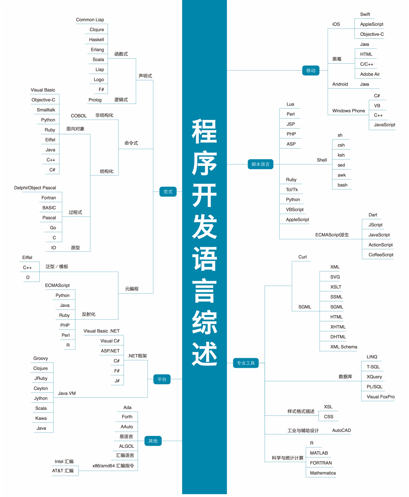

# 编程语言本身

其实只要是质量合格的教程，如果想要讲清楚一些问题，就必然要提及一些，关于编程语言的设计，编译和解析，内存管理、发展历史和一些思潮。

比如Java教程们一定是要解释字节码的，甚至还会讲堆内存和栈内存。再比如，如果你要讲js的变量提升，就一定要说预处理，如果你要讲debug，就一定要讲函数的调用栈。

如果你学过js，也恰好打算巩固一下js基础，那么我推荐李立超老师的[这个教程](https://www.bilibili.com/video/BV1bS4y1b7NV/)，虽然整套视频是讲react，但是前十几个视频是纯讲ES不掺一点react，当中讲了一些语言设计上的东西让我有如拨云见日。

但是这个文档并不是某种读书笔记或者系统教程，只是把我关于这方面的一些浅薄想法整理起来。因此这是一个问题导向的文档。

## 为什么说类是函数的语法糖
以后再写

## 通过Python的self看js的this
以后再写

## 关于编程范式

截止2024年8月6日，范式在我这个等级里是一个比较高深晦涩的词，似乎代表着某种远古力量。鉴于我目前接触过的语言只有Java，JS和Python，我觉得在学习更多语言之前我对这个问题不会有太多理解。

我想起了这张图，图源 [互联网技术图谱 —— canmengfly@github](https://canmengfly.github.io/techmap/#)，希望将来有一天我能对这张图侃侃而谈。

但是我也能胡扯一点，对不对我就不知道了：

结构化编程，bob大叔在他的书里提到（由于bob大叔的几本书我是混着看的，我不太记得编程范式是哪本书写的了）在结构化编程的概念出现之前，代码中充斥着goto语句。

我没有体验过那些上古语言，但是我在Windows的batch脚本里用过goto，这东西让你可以标记一处地点然后在任何地方瞬间传送过去 —— 以前不感觉有什么，现在觉得十分crazy。

而结构化编程的思想就是，代码只使用顺序结构、分支结构、循环结构就可以完成所有任务(熟悉又陌生的三个词)，这在今天看来是理所应当的事情，但bob大叔说这在当年这是需要证明的，人们花了很多时间才逐渐普及结构化编程。

面向对象就不说了，正值面向对象的时代，它是绝大多数人的默认选项。

函数式编程，我常在知乎听人谈haskell，lisp，clojure这些词，但同样也只觉得高深，未曾感受过函数式编程的魅力。后来在js自己亲自用了一次闭包 —— 理解闭包代码和遇到问题主动去使用闭包真的是两回事 —— 感觉十分美妙。