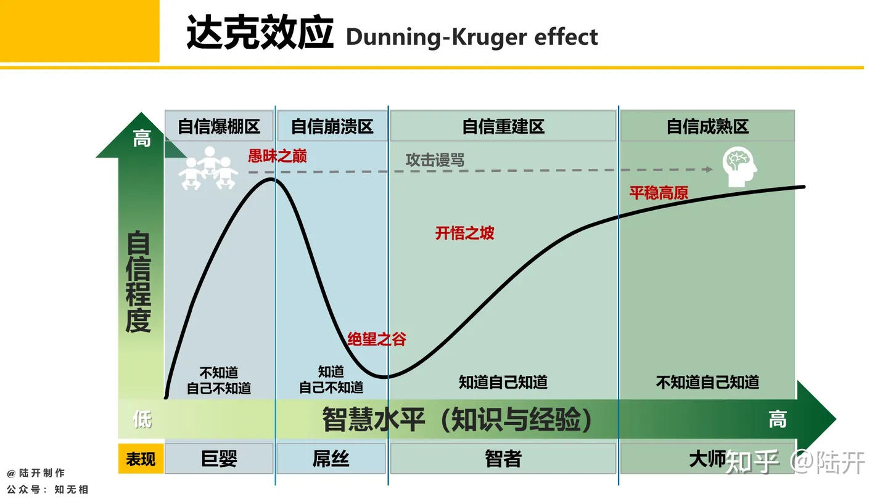

# 怎么写项目

## 写一个项目的过程
以后再写

## 细处代码怎么写
以后再写 先记一两个小点

- 可读性第一，写代码的重点在于沟通，因为你在写代码的时候大多数时间在阅读自己的或者别人的代码，写代码首要任务就是在跟未来的自己或者跟别人沟通(在实现功能的基础上)。自然语言很讲究人跟人的沟通效率，编程语言自然也是如此。
    - 这里整理一些让我比较收益的《代码整洁之道》的观点 

## 模块化和接口设计

### Invalid s主张充分理解需求
我觉得这篇文章写的挺好：

[我想听你讲软件模块划分和接口设计，但你就是不说这俩词？—— invalid s @知乎](https://zhuanlan.zhihu.com/p/413172583)

> 在你明白需求之前，是不可能有正确的模块划分/接口设计的；而在你把需求彻底搞明白之后，模块划分/接口设计其实就在那里了——在一份好的需求规格书面前，合格水平的软件工程师会各自独立的做出相似度极高的设计。
> 
> 因为它就藏在需求规格书里。

但是这个观点似乎和bob大叔是背离的，bob大叔认为`好的系统架构设计应该尽可能做到与'形状'无关。`（出自架构整洁之道第二章，这里的形状是指需求。）

我需要更多的实践和阅读来甄别取舍，不能盲从。

### Bob大叔的观点

#### 观点一：衡量架构优劣的一个标准是变动成本

这一点似乎没有什么好辩证的，设计一个好架构的目的就是为了高扩展性和低维护成本。

听说valve的fortress2（一个在steam上在线人数常年靠前的游戏）只有两个人在维护，现在的同时在线人数是七万多。

#### 其他观点
后面再补吧，先记录几个小点

- 软件就是要足够软，如果不可变动，它和硬件有什么区别？
- 

## “昨天写，今天忘”

这是一个程序员名梗。

如果刚接触这个梗的时候觉得有意思，那你是个玩梗小鬼。

过了一段时间觉得，这么自嘲的人一定就是网上那种垃圾程序员吧，那你此时正处于"愚昧之巅"：

我经历过这两个阶段，直到这个梗在我身上应验。

当面对真实的需求，软件开发这件事的复杂度确实会让人在精神层面和物理层面一起stackoverflow的(指人脑栈溢出，和在stackoverflow上搜索解决方案)。

目前我解决这个问题的方法就是写下来。可以把自己当做一个执行开发任务的AI，以一个AI的身份输出日志，我遇到了什么问题，有哪些可行的方法，简单尝试之后需要多少时间精力成本，是否值得...等等。

也可以不按照时间写，而是直接写项目文档，去解释在这方面你是怎么做、怎么想的，为什么这么决定。